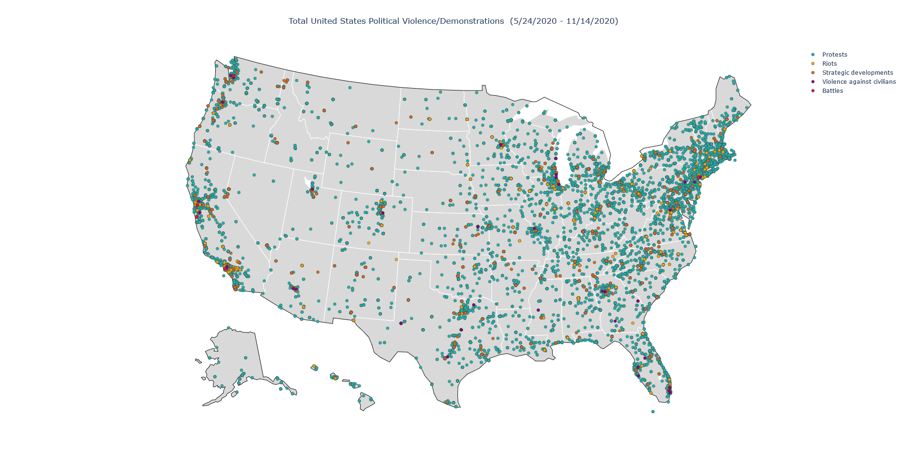
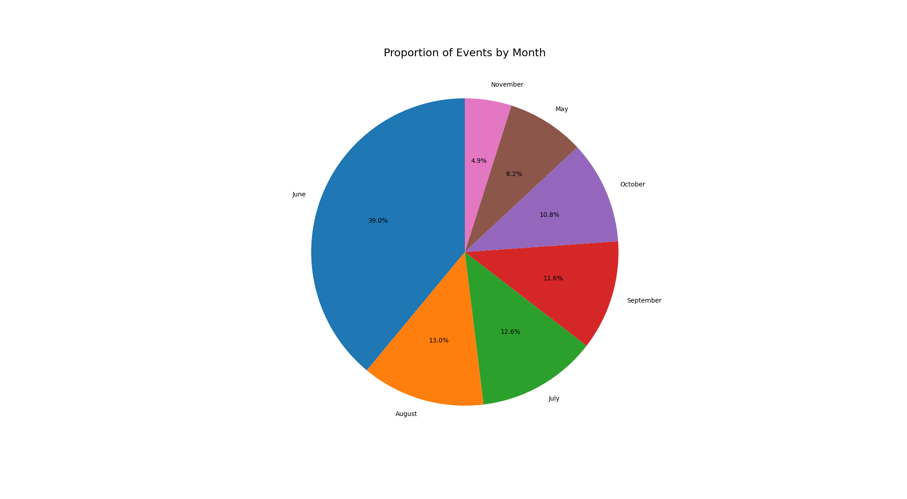
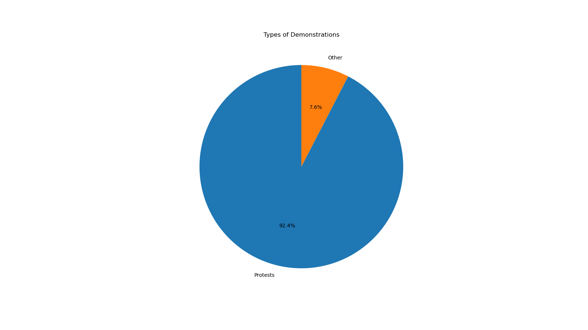
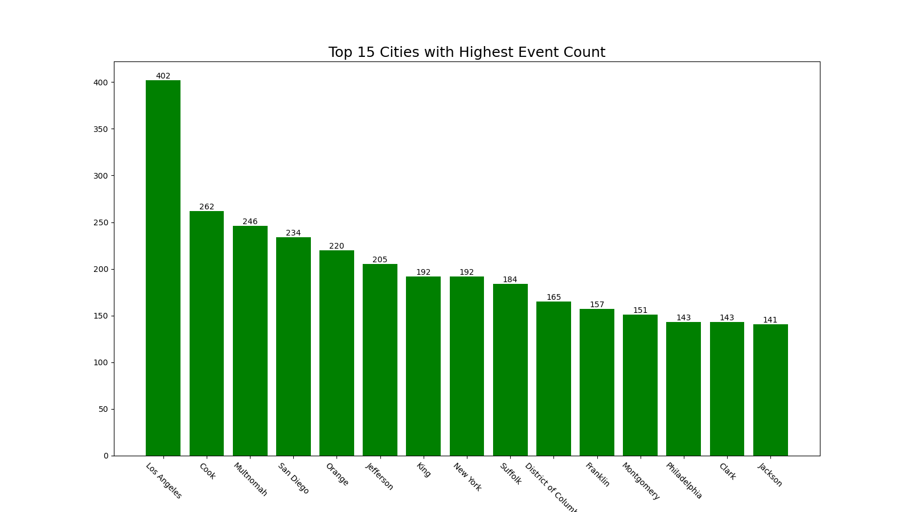

# United States Crisis Monitor


## Project Significance
The purpose behind visualizing the United States crisis data was to help illustrate the magnitude of unrest that occurred throughout 2020, and the possible severity of the ramifications.
The Armed Conflict Location and Event Data Project ACLED <sup>1</sup> has labeled this the "crisis" dataset which seems severe at first.
Recalling the simultaneous downfalls resulting from a contracting economy in the midst of the COVID-19 pandemic, and from having a presidential election in a very divided setting, it seems justifiable to label this period of time a crisis.
Visualizing the scope of turnout for political violence and demonstration through this era of heightened risk and an ongoing pandemic is also an opportunity to showcase the benefits of visualizing spatial data.


## Data Summary

The data was collected from the US Crisis Monitor dataset that was collected by the ACLED <sup>1</sup>.
They describe political violence and demonstrations as either: battles, protests, riots, strategic developments, or violence against civilians.
The data set records all instances of violence or demonstration in addition with their longitude and latitude points and some notes given the specifics of the event.
This made the visualization easier as all the manipulations would be done to the data set, and let the programs generate the maps.
First off, the original data set is given as an Excel spreadsheet.
It was best to convert the data set to a comma separated variable (CSV) data set, so that the manipulations could be done utilizing pandas in python.

## Data visualization

The first visualization created illustrates the total number of political violence and demonstrations between May 24, 2020 - November 14 2020.
This visual helps paint a better picture of the magnitude of the frequency at which these politically motivated events occurred.



The next visual is based off of the same data but is an animation of total events by month.
By animating the progression of the frequency of the events, we can visualize how rapidly the number of demonstrations increased in June and July and how events continued to persist until November.  


Both of these visuals were created in python's plotly library in the [create_spatial_visualization.py](https://github.com/JamilAbbas-Hub/us_crisis_monitor/blob/master/create_spatial_visualization.py) script.

## Exploratory Data analysis

Next, some figures are created to help visualize statistics about these political demonstrations and gather a deeper understanding of what type, and where these events occurred.
The first chart describes the proportion of events by month to accompany the animated visual above.



The next chart shows us the proportion of events that were labeled as protests.
The 'other' category refers to the sum of all events that aren't protests.
These include: battles, riots, strategic developments, and violence against civilians.

 

 As can be seen an extremely large majority of these events were protests.
 Next, to gather some insight as to where these events took place, the top 10 states and top 15 cities by event frequency are graphed.


California had the most events by quite a large margin, New York coming in second.



The visuals were created in the [create_save_EDA_images.py](https://github.com/JamilAbbas-Hub/us_crisis_monitor/blob/master/create_save_EDA_images.py) script.  

## Impacts on the COVID-19 Pandemic

One of the reasons the ACLED labelled these events a 'crisis' was due to the fact that these large gatherings were taking place at the height of the COVID-19 pandemic.
Despite the majority of these events taking place outside, it is still a major reason for concern and still ultimately question whether these events had an impact on COVID-19 case numbers.
We attempt to answer this question by conducting some analysis comparing COVID-19 case numbers with the frequency of events within a specific area.  

Daily COVID-19 case data for the two states with the highest event frequency (California and New York) was taken and compared to a two week lag of the number of events that happened in the given state. <sup>2</sup>
The two week lag is accounting for possible dormant COVID-19 symptoms, and cases as a result of attending these events occurring later on. Selecting the total cases two weeks after an event should encapsulate the total impact the number of events had on case numbers, if they had any impact at all.
The total number of events is regressed to try to predict total case numbers two weeks into the future.
The outputs of both California and New York regressions are displayed below respectively:  

```
#California regression

OLS Regression Results
=======================================================================================
Dep. Variable:     2_week_delay_cases   R-squared (uncentered):                   0.193
Model:                            OLS   Adj. R-squared (uncentered):              0.186
Method:                 Least Squares   F-statistic:                              27.23
Date:                Mon, 10 May 2021   Prob (F-statistic):                    8.20e-07
Time:                        21:04:59   Log-Likelihood:                         -1668.5
No. Observations:                 115   AIC:                                      3339.
Df Residuals:                     114   BIC:                                      3342.
Df Model:                           1
Covariance Type:            nonrobust
==============================================================================
               coef    std err          t      P>|t|      [0.025      0.975]
------------------------------------------------------------------------------
Protests    1.188e+04   2277.373      5.218      0.000    7371.936    1.64e+04
==============================================================================
Omnibus:                       23.186   Durbin-Watson:                   0.053
Prob(Omnibus):                  0.000   Jarque-Bera (JB):               29.488
Skew:                          -1.142   Prob(JB):                     3.95e-07
Kurtosis:                       3.966   Cond. No.                         1.00
==============================================================================
```

```
#New York regression

OLS Regression Results
=======================================================================================
Dep. Variable:     2_week_delay_cases   R-squared (uncentered):                   0.486
Model:                            OLS   Adj. R-squared (uncentered):              0.482
Method:                 Least Squares   F-statistic:                              107.8
Date:                Mon, 10 May 2021   Prob (F-statistic):                    3.52e-18
Time:                        21:04:59   Log-Likelihood:                         -1613.2
No. Observations:                 115   AIC:                                      3228.
Df Residuals:                     114   BIC:                                      3231.
Df Model:                           1
Covariance Type:            nonrobust
==============================================================================
                 coef    std err          t      P>|t|      [0.025      0.975]
------------------------------------------------------------------------------
Protests    2.844e+04   2738.931     10.384      0.000     2.3e+04    3.39e+04
==============================================================================
Omnibus:                       62.931   Durbin-Watson:                   0.335
Prob(Omnibus):                  0.000   Jarque-Bera (JB):              178.696
Skew:                          -2.163   Prob(JB):                     1.57e-39
Kurtosis:                       7.311   Cond. No.                         1.00
==============================================================================
```

From the results, it is noted that 'Protests' (in this regression 'Protests' refers to all events that occurred) in both regressions is a statistically significant variable in predicting COVID-19 cases two weeks into the future.
While this does indicate that the event frequency did indeed have an impact on the pandemic, the $R^2$ values of both regressions are worth noting (0.193 and 0.486 for California and New York respectively).
Despite the fact that event frequency is significant in predicting COVID-19 cases, the low $R^2$ value suggest the percentage of variance the independent variable (Protests) is explaining about the dependent variable (COVID-19 cases) is low.
This makes sense as there are numerous amount of variables that go into explaining COVID-19 case numbers, and the model is too simple to encapsulate all of them.
While this doesn't confirm anything about the relationship between the 'crisis' and COVID-19 cases, it is a beginning step and further analysis can be done to help provide an answer.

The regressions are performed in the [covid_analysis.py](https://github.com/JamilAbbas-Hub/us_crisis_monitor/blob/master/covid_analysis.py) script.   


## References
<sup>1</sup> Armed Conflict Location and Event Data Project, "US Crisis Monitor", Accessed 2021-05-01, Online: https://acleddata.com/special-projects/us-crisis-monitor/  
<sup>2</sup> The Covid Tracking Project, Accessed 2021-04-20, Online: https://covidtracking.com/
